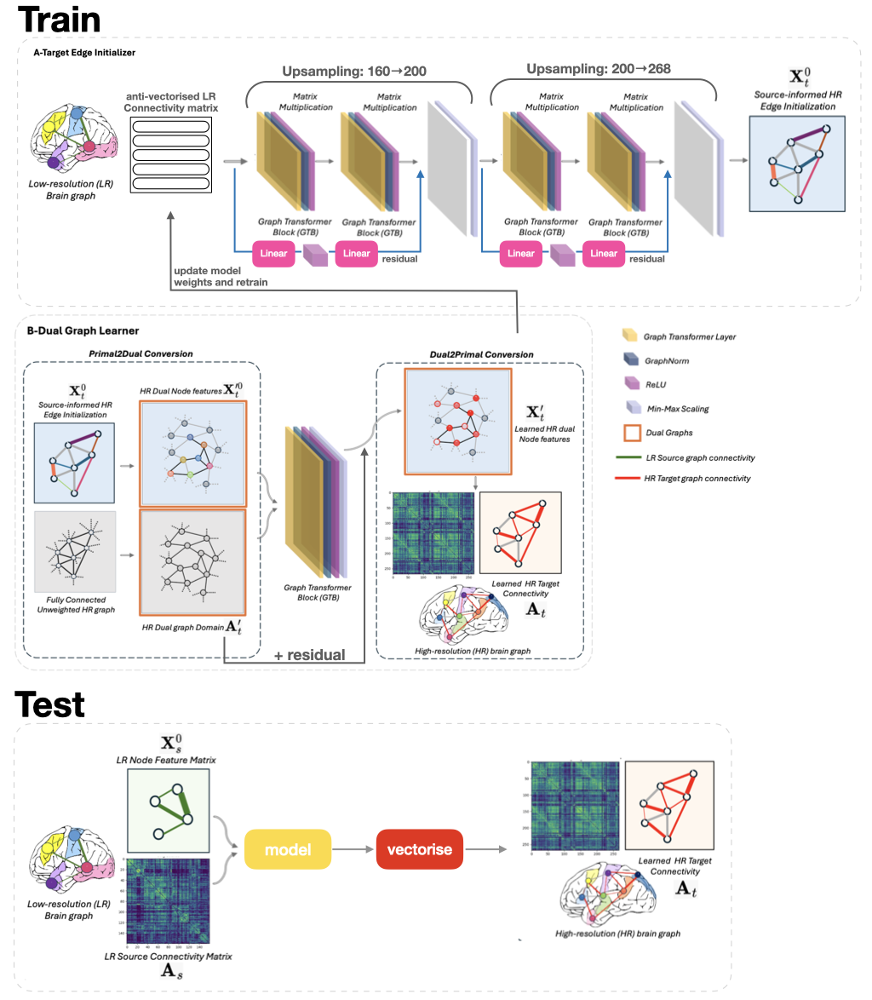
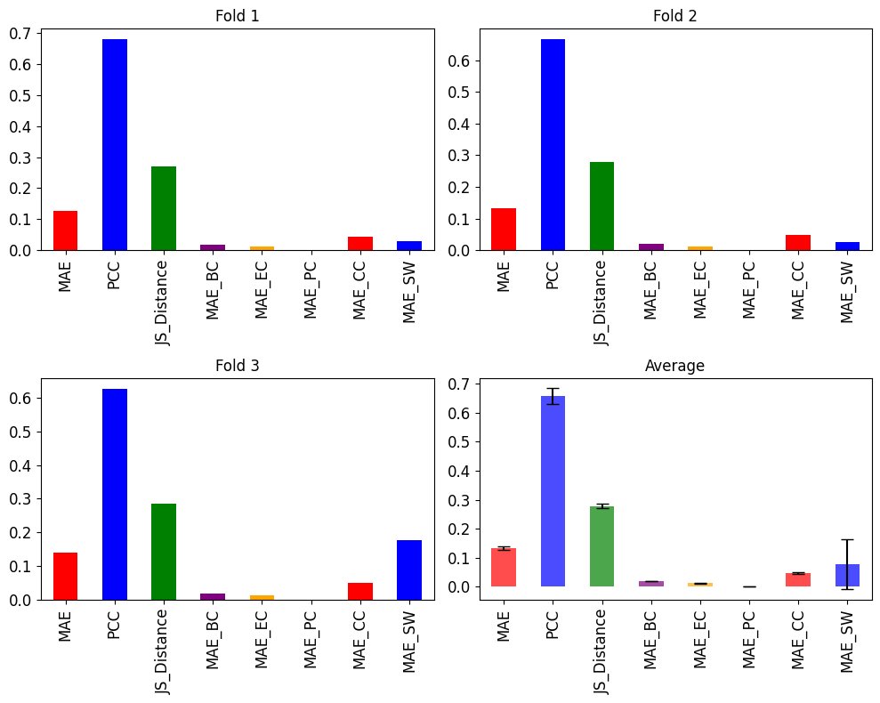
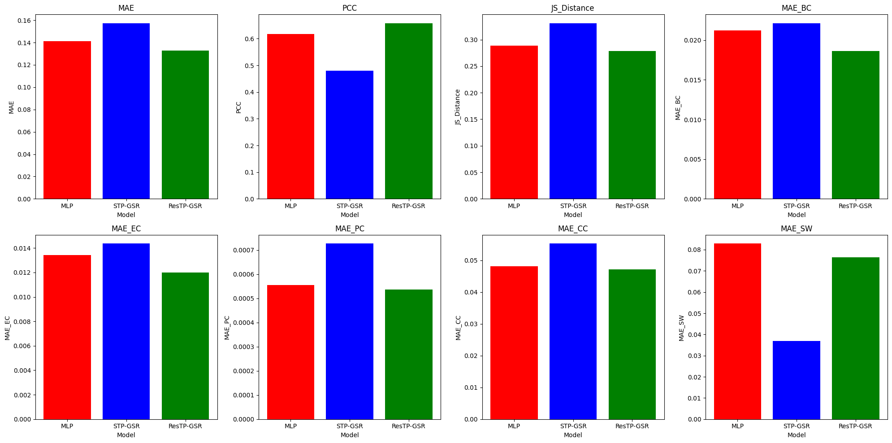

# DGL2024 Brain Graph Super-Resolution Challenge

## Contributors

- Zimeng Zhou, Som Sinha, Oliver Shakespeare, Nina Peire, Michael Hodgins

## How to Run the Code

1. `cd ResTP-GSR`
2. `python3 main.py dataset='custom'`

`main.py` contains code to run the 3-fold cross-validation on our model, ResTP-GSR. It also saves the predictions for each fold in `ResTP-GSR/results/restp_gsr/custom/run1/fold_*/predictions_fold*.csv`. It will also generate the bar plots and save them in `evaluation/soap/evaluation.png`

All the configurations can be modified in `config/experiment.yaml`, `config/model/restp_gsr.yaml`, and `config/dataset/custom.yaml`. The results generated used the default configuration.

In `config/experiment.yaml` we can configure the training parameters:

- `n_epochs`: number of epochs to train the model, the default is 30
- `batch_size`: number of samples in each training batch, the default is 16
- `output_csv`: bool to specify if we want to train on all the training data (for kaggle)

In `config/model/restp_gsr.yaml` we can configure our model parameters in the following two blocks:

- `target_edge_initializer`
- `dual_learner`

In `config/dataset/custom.yaml` we configure our dataset parameters.

We assume our data is in the `data` folder.

## Problem Description

<!-- A short description of the problem you are solving. Why is the brain graph super-resolution an ineresting problem to solve? -->

This repository focuses on the problem of Brain Graph Super-Resolution. Graph super-resolution is the process of generating a graph with $N'$ nodes from a graph with $N$ nodes, where $N' > N$. The goal is to develop a model capable of inferring a higher-resolution graph from a lower-resolution graph, with additional nodes (and edges), while preserving the structure and functional properties of the original graph.

Brain Graph Super-Resolution poses both immense potential as well as significant challenges. The code in this repository demonstrates how we can effectively generate higher resolution brain graphs which could lead to improved diagnostics and treatment. The key challenge still lies with evaluating such super-resolved graphs in the absence of a ground truth.

## ResTP-GSR - Methodology

<!-- - Summarize in a few sentences the building blocks of your generative GNN model.
- Figure of your model. -->

The generative GNN model, referred to as ResTP-GSR, can be split into a Target Edge Initialiser part, and Dual Graph Learner part.
The Target Edge Initialiser upsamples the Low-Resolution Graph in two phases (160 to 200 and 200 to 268) using TransformerConv blocks with residual connections.
The Dual Graph Learner then converts the graph from its primal form to the dual, after which the values are refined using another TransformerConv block with residual connections.
The dual is then converted back into the primal.

## Used External Libraries

To install the required dependencies, run:
`pip install -r requirements.txt`

## Results

## References

We use the findings from P. Singh and I. Rekik on topoligical preserving GNNs [3], and build on this work to create ResTP-GSR, using other graph modelling techniques.

- M. Isallari and I. Rekik, ‘‘Brain graph super-resolution using adversarial
  graph neural network with application to functional brain connectivity,’’
  Medical Image Analysis, vol. 71, p. 102084, 2021. [Online]. Available:
  https://www.sciencedirect.com/science/article/pii/S1361841521001304
- E. Van Reeth, I. W. K. Tham, C. H. Tan, and C. L. Poh, ‘‘Super-
  resolution in magnetic resonance imaging: A review,’’ Concepts in
  Magnetic Resonance Part A, vol. 40A, no. 6, pp. 306–325, 2012.
  [Online]. Available: https://onlinelibrary.wiley.com/doi/abs/10.1002/cmr.
  a.21249
- P. Singh and I. Rekik, Strongly Topology-Preserving GNNs for
  Brain Graph Super-Resolution. Springer Nature Switzerland, Oct.
  2024, p. 124–136. [Online]. Available: http://dx.doi.org/10.1007/
  978-3-031-74561-4_11
- T. Tarasiewicz and M. Kawulok, ‘‘A graph neural network for
  heterogeneous multi-image super-resolution,’’ Pattern Recognition
  Letters, vol. 189, pp. 214–220, 2025. [Online]. Available: https:
  //www.sciencedirect.com/science/article/pii/S0167865525000297
-
